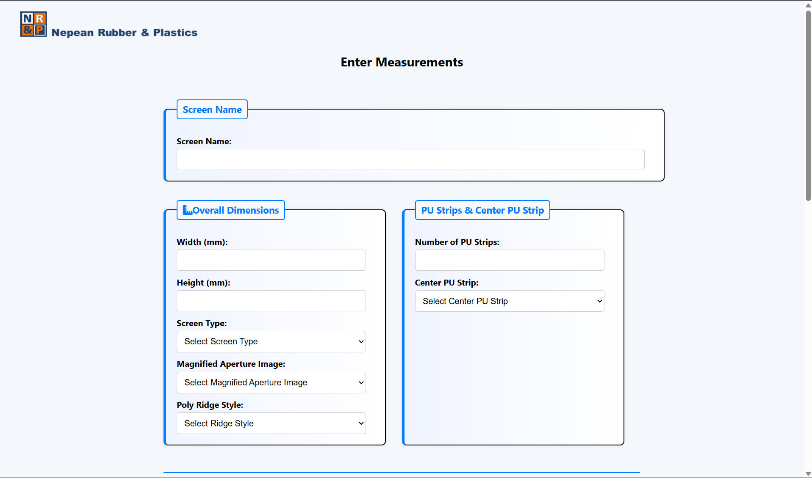
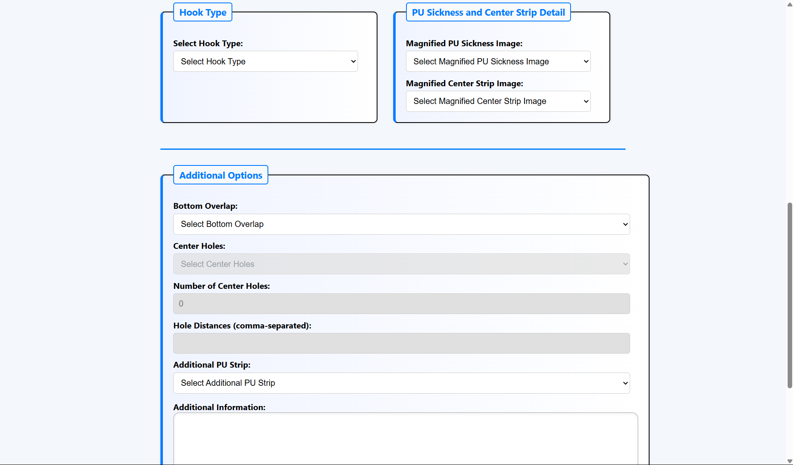
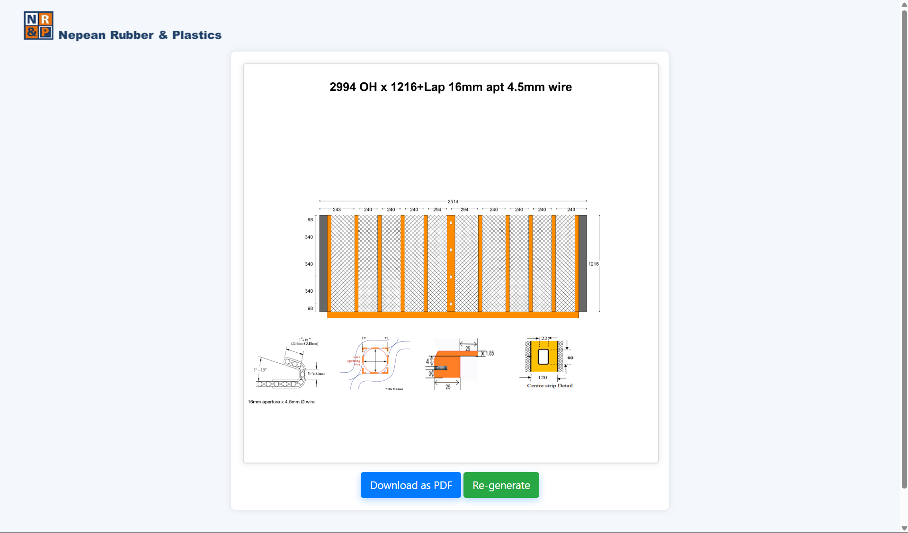
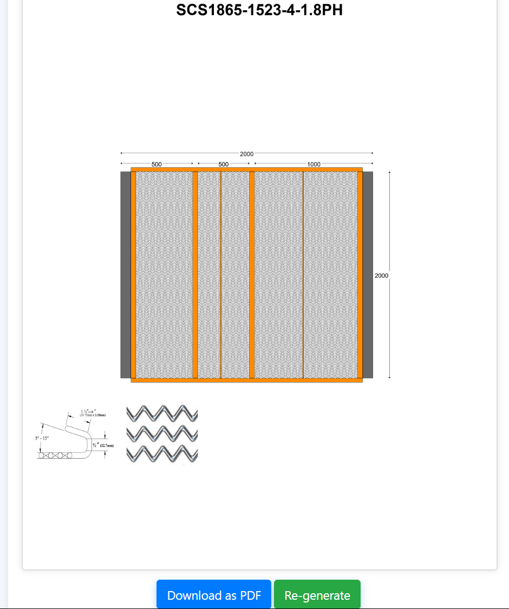
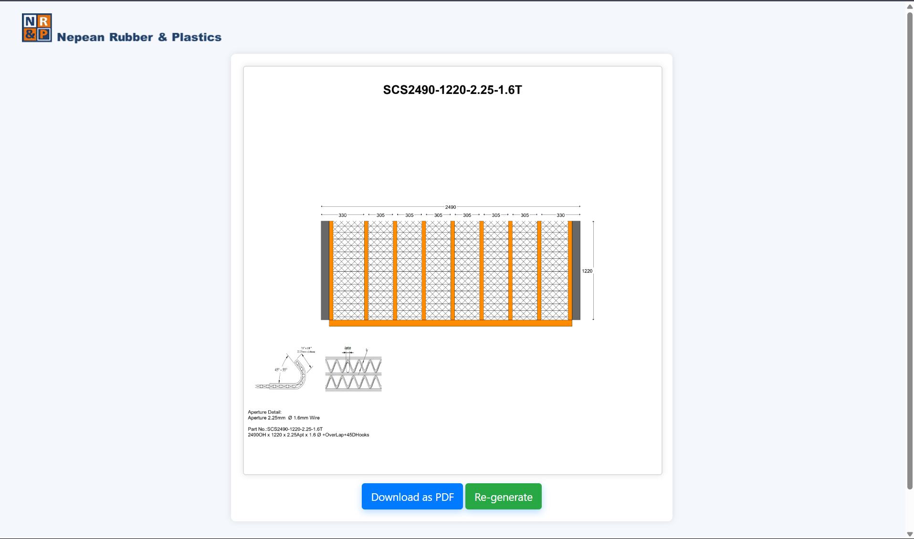
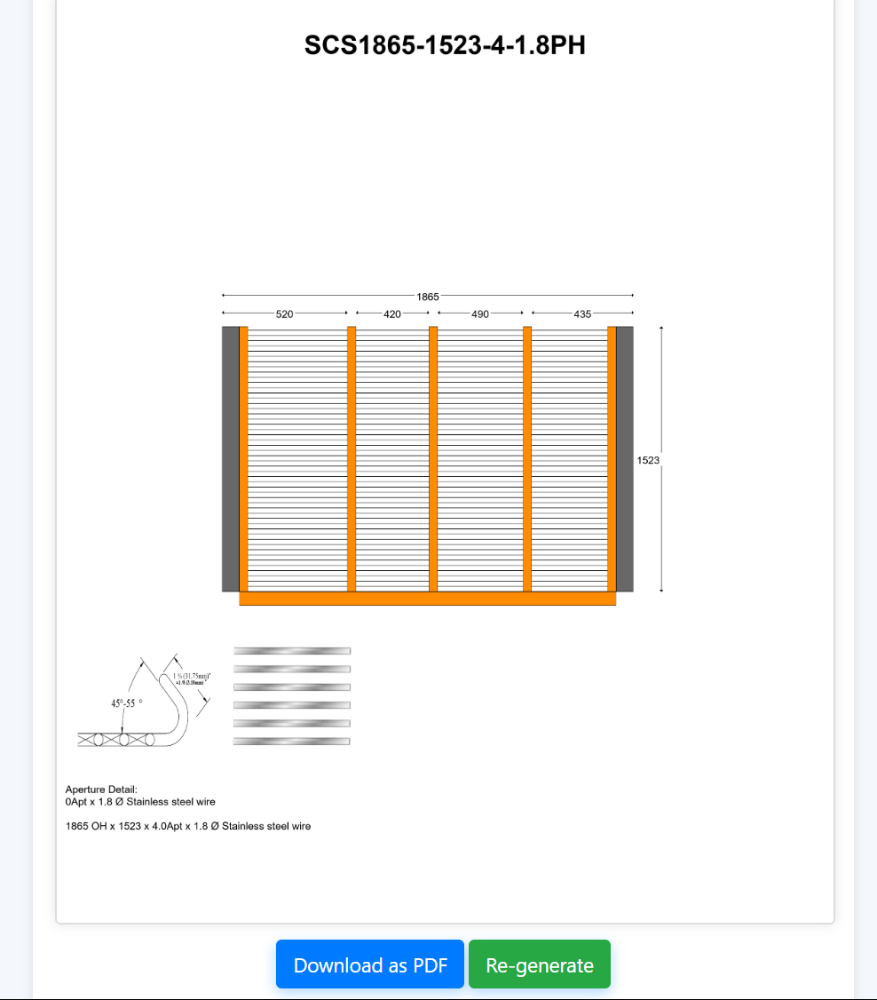
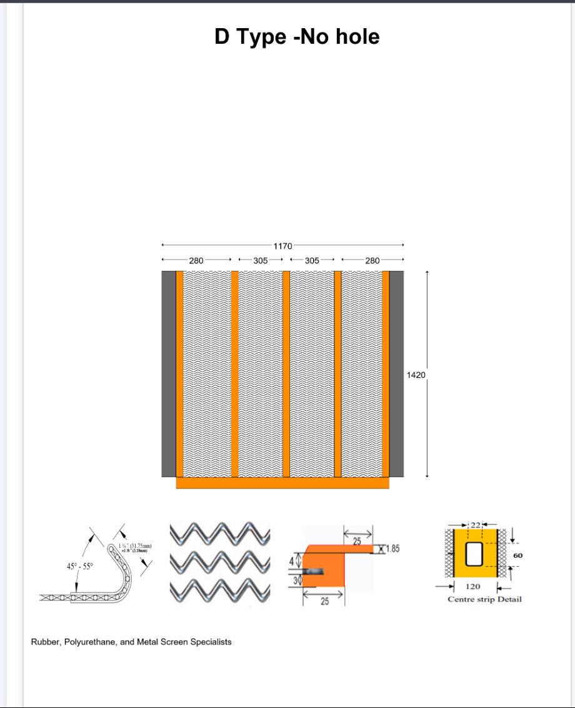
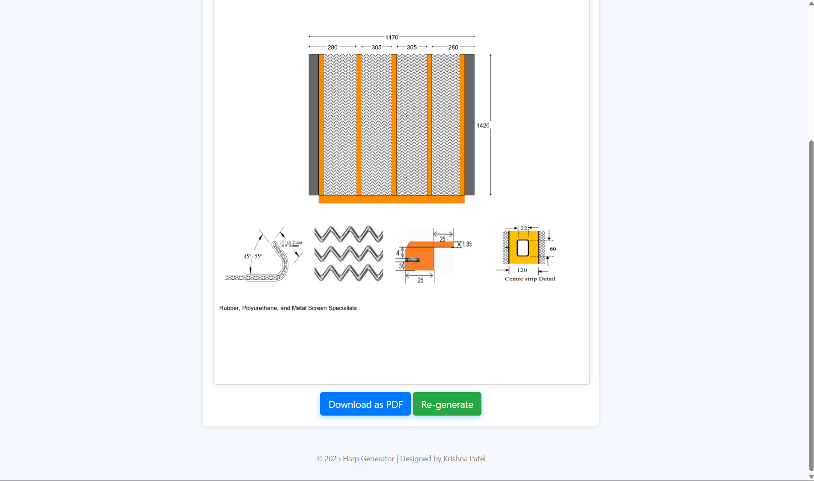
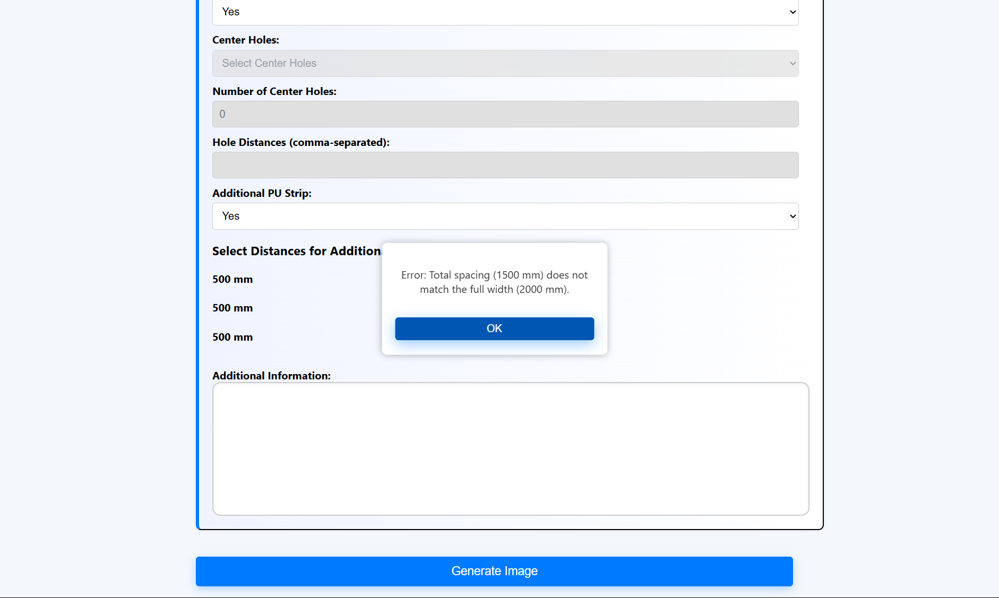

PU Screen Generator 
A fully functional web application to visually design and generate PU Harp configurations for industrial screening applications.
Built using Flask, Python, HTML/CSS, and PIL/OpenCV, this project enables users to customize spacing, strip styles, hook types, and more, then download the result as PDF.

---

🔍 Features

- Live preview of generated PU screen
- Custom spacing, bar count, and strip layout
- - Optional center overlaps, hooks, poly ridge strips, and PU strip configurations
- Input validation for spacing and dimensions
- Export output as high-resolution PDF
- Responsive user interface

---

## 💡 Problem Solved
Manual PU screen design required repetitive calculations and manual drafting, increasing time and risk of error.

This application automates the entire process by converting user inputs into accurate engineering diagrams and production-ready PDFs.

---

 🛠️ Tech Stack

- Backend: Python, Flask
- Frontend: HTML5, CSS3 (custom), EJS-style templating via Jinja2
- Image Processing: NumPy, PIL (Pillow), OpenCV, Matplotlib
- PDF Export: ReportLab

---

 🚀 Getting Started

Install Python  
Python 3.10+ recommended.

 1. Clone the repo
```bash
git clone https://github.com/PatelKrishna02/pu-screen-generator.git
cd pu-screen-generator
```

 2. Set up virtual environment
```bash
python -m venv venv
source venv/bin/activate  # Windows: venv\Scripts\activate
```

 3. Install dependencies
```bash
pip install -r requirements.txt
```

 4. Run the app
```bash
python app.py
```

Visit `http://127.0.0.1:5000` in your browser.

---

## Deployment (IIS - Windows)

This application can be deployed on IIS using FastCGI.

Steps include:
- Install Python on the server
- Configure FastCGI / wfastcgi
- Set up IIS site pointing to application directory
- Configure web.config and WSGI entry point

Note: Deployment configuration files are not included to keep the repository platform-independent.

## 🖼️ Screenshots



 
 
 


 


---

 📄Use Case
A manufacturing engineer wants to visualize a custom PU screen configuration with 10 bars, specific spacings, and hook type 2. The user fills in the form, previews the layout, and downloads a production-ready PDF to send to suppliers.

---

## 🚀 Highlights
- Full-stack application combining UI, backend logic, and image processing
- Automates a real-world engineering workflow
- Generates production-ready outputs used in manufacturing
- Demonstrates practical problem-solving through software

---

 📫 Contact
**Krishna Patel**  
Bachelor of ICT (Cybersecurity & Ethical Hacking)  
Western Sydney University  
[LinkedIn](https://www.linkedin.com/in/krishnapatel16) • [GitHub](https://github.com/PatelKrishna02)

---

## License
This project was developed for internal/company use. Code is shared for demonstration purposes only.
